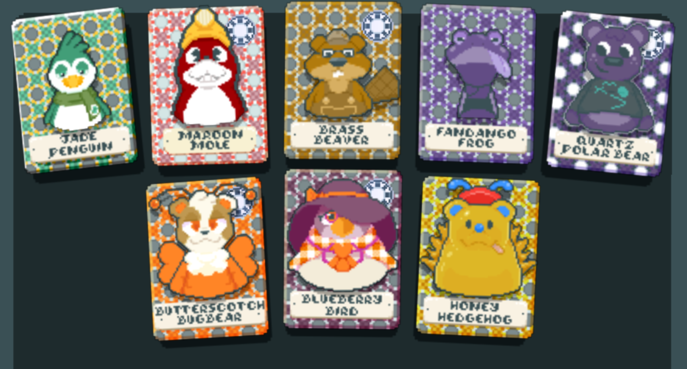

# Jade Penguin's Adapt or Toast! 
Otherwise known as: Oh Boy! That Card Eating Green Scarf Wearing Penguin Jade Penguin Has Got Himself a Team of Animal Characters to Screw Over Your Runs Now! You Better Adapt To The Changes or You'll Be Toast! (Also There's Finity Support, So You Can Really Get To Know Their True Potential!)

Adds a good chunk animal-themed Showdown Bosses to duel and potentially assist in your runs, most of the coding and art is done by Camostar34, so thank them! Now enjoy losing your runs in style!

Requires Steamodded [smods-1.0.0-beta-1016c](https://github.com/Steamodded/smods), [Lovely](https://github.com/ethangreen-dev/lovely-injector) and 
[Finity](https://github.com/frangnosquest/Finity), since most of the content involves the Showdown Jokers. 

## Additions:
- 8 new animal-themed Showdown Blinds (A size enough for it's own special spin on Finity's Challenger's Deck!)
- 8 additional Showdown Jokers to help with high scoring endless runs.

# Crossmods
Aside from Finity, there is no crossmod content... yet! Stay tuned. 

### Credits
- [chartreusechamber](https://balatromods.miraheze.org/wiki/User:JPenguin) - The main penguin!
- [Camostar34](https://balatromods.miraheze.org/wiki/User:Camostar34) - Main coder and Joker Artist 
- [candycaneanniahlator(etherware2)](https://balatromods.miraheze.org/wiki/User:Candycanearter07) - Jade Penguin Joker and Blind effect + general coding help and ideas

